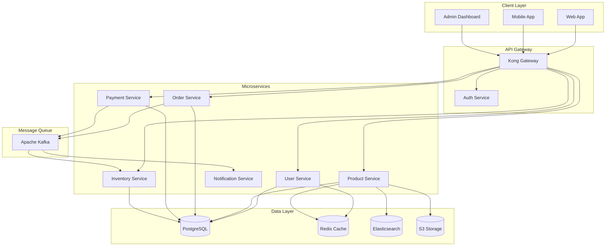
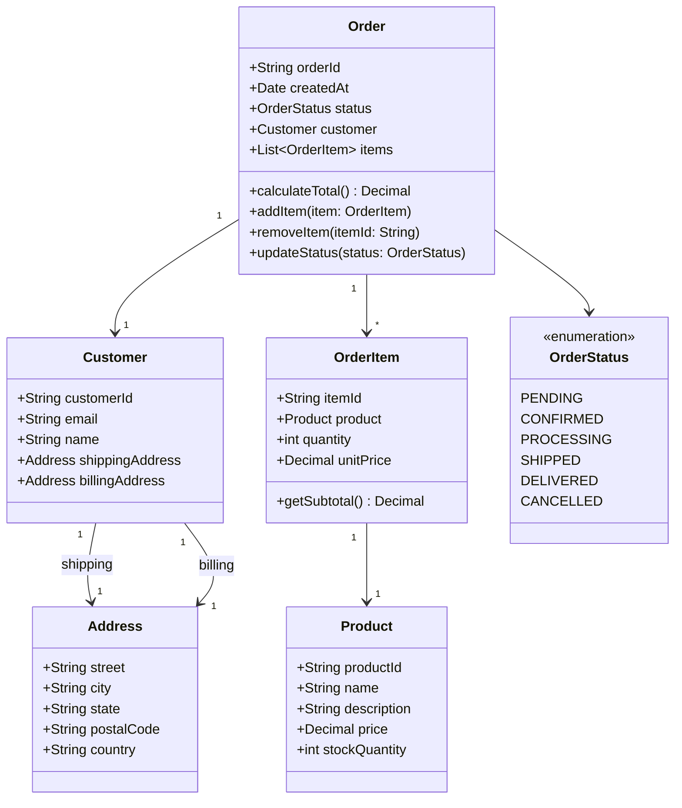
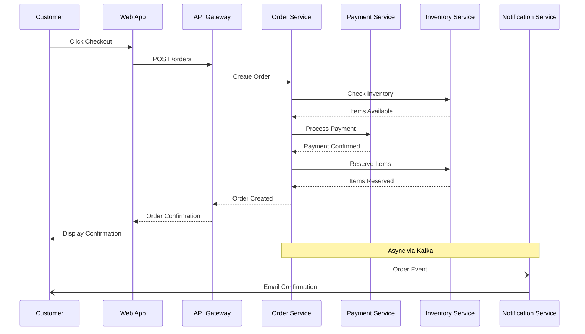
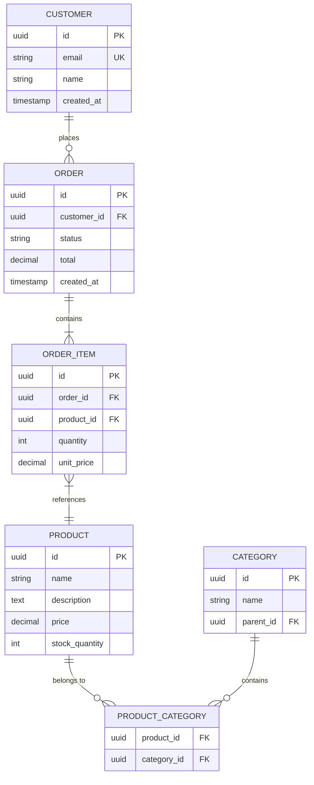
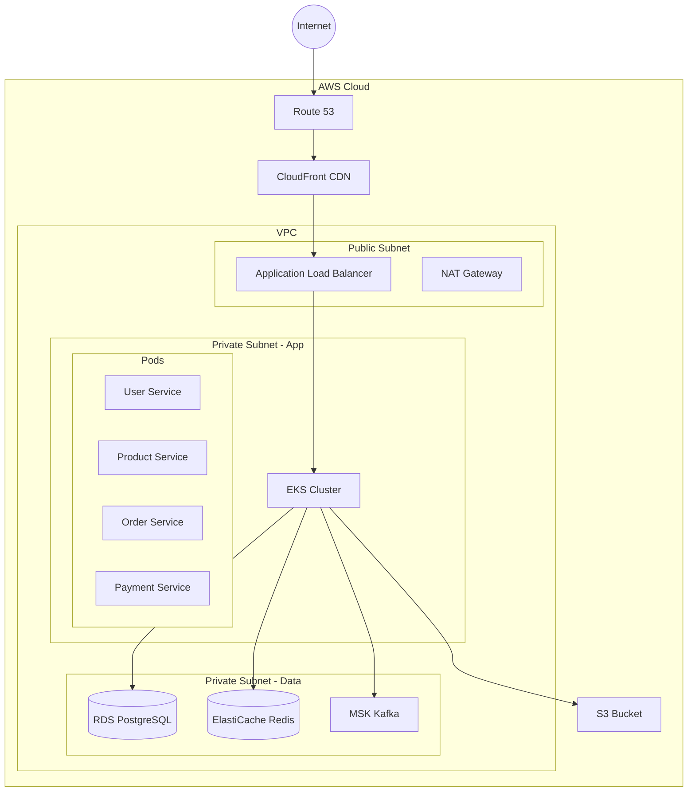

# Software Architecture: E-Commerce Platform

This document demonstrates Mermaid diagrams for visualizing software architecture.

## System Overview

## Class Diagram: Order Domain

## Sequence Diagram: Checkout Flow

## Entity Relationship Diagram

## Deployment Architecture

## Summary

This architecture demonstrates:
- **Microservices**: Loosely coupled services with single responsibilities
- **Event-driven**: Kafka for async communication between services
- **Caching**: Redis for performance optimization
- **Search**: Elasticsearch for product search
- **Cloud-native**: Containerized deployment on Kubernetes
