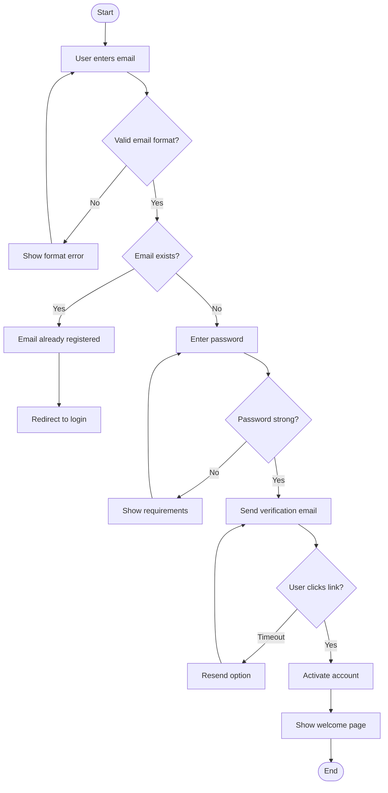
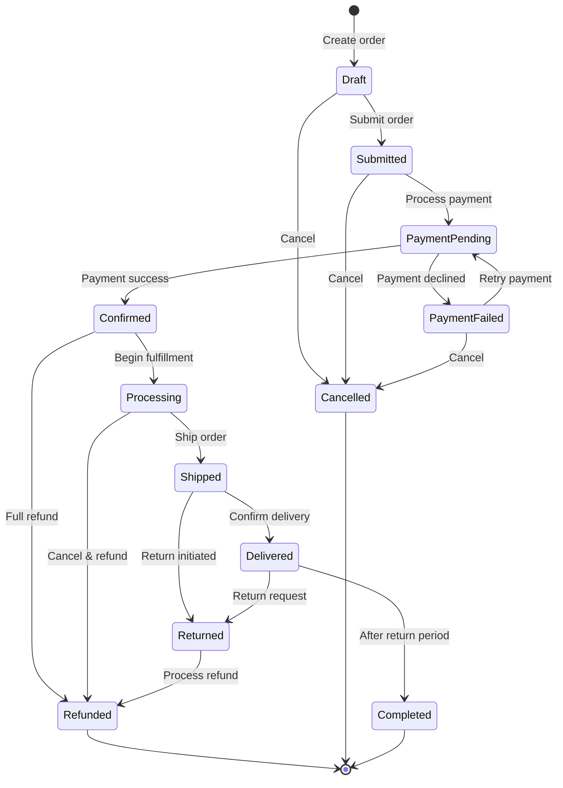
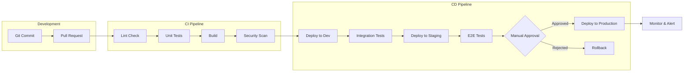
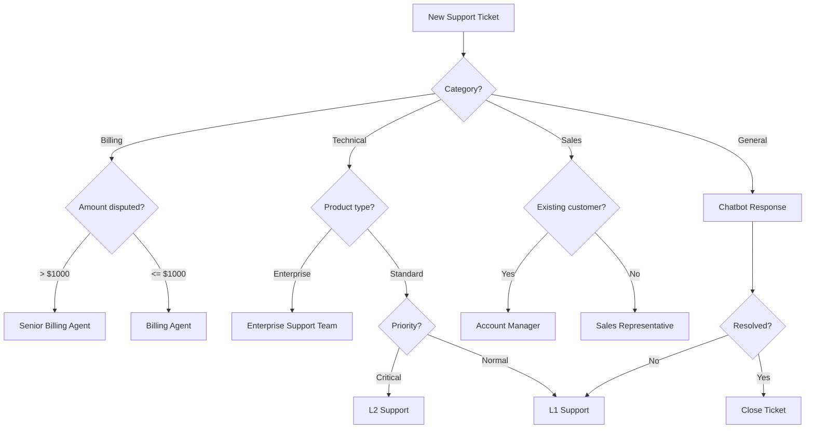
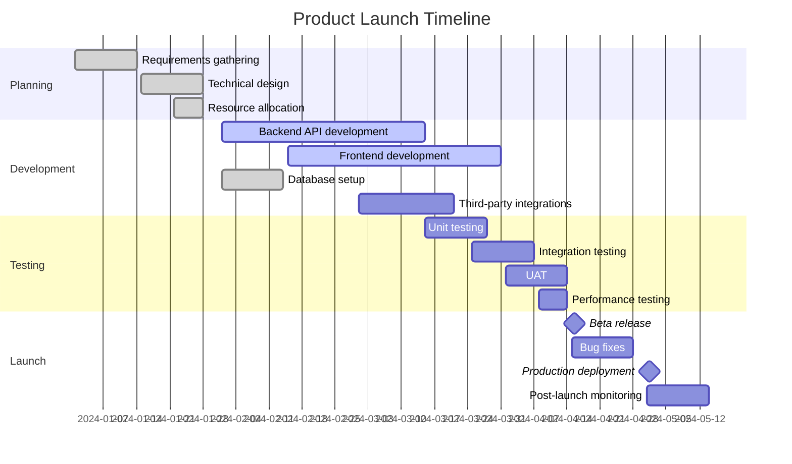
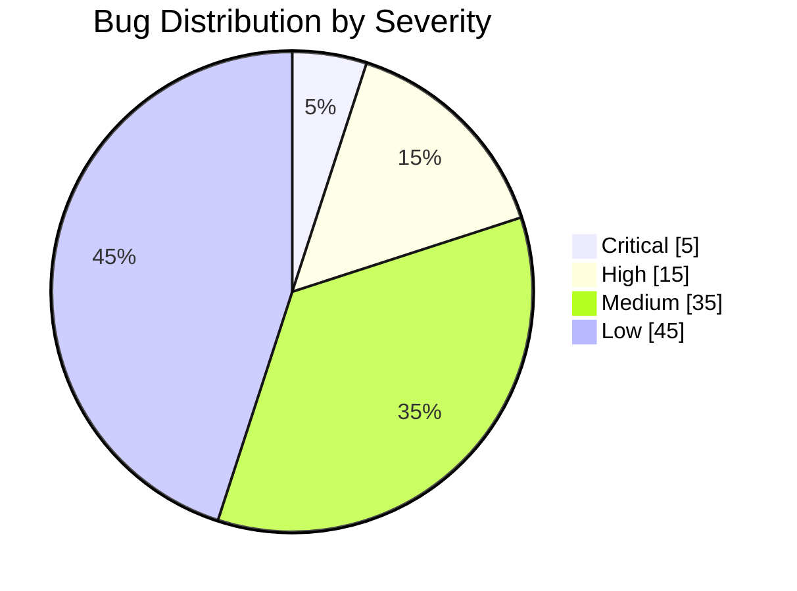
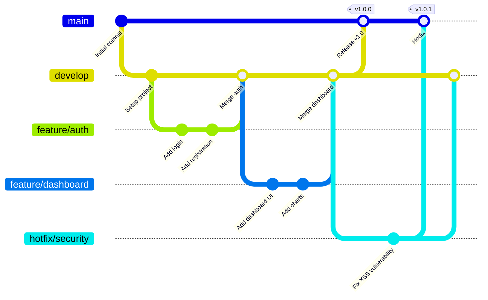
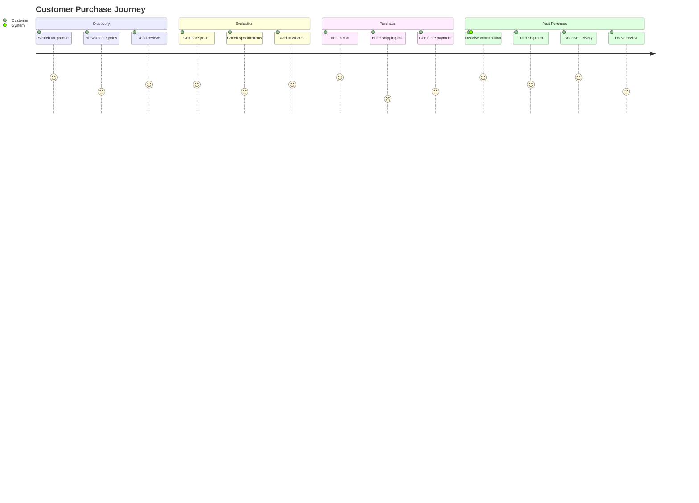

# Process Flowcharts and State Diagrams

This document demonstrates various Mermaid diagram types for process visualization.

## User Registration Flowchart

## Order State Machine

## CI/CD Pipeline

## Decision Tree: Support Ticket Routing

## Gantt Chart: Project Timeline

## Pie Chart: Bug Distribution

## Git Workflow

## User Journey Map

## Summary

This document showcases Mermaid's versatility:
- **Flowcharts**: Process flows and decision trees
- **State diagrams**: State machines and transitions
- **Gantt charts**: Project timelines
- **Pie charts**: Data distribution
- **Git graphs**: Version control visualization
- **Journey maps**: User experience flows

Mermaid enables teams to create maintainable diagrams as code, keeping documentation in sync with development.
